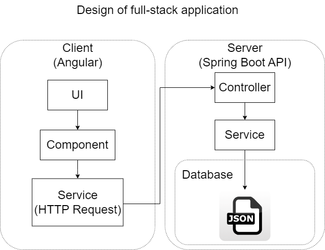

# assignment2
### Design

* Backend: Spring Boot Rest API
* Frontend: Angular
* Function: Display employees record table.

### How to run it
1. Run EmployeeApplication in one terminal.
1. Under employeeApp folder, run `ng serve` in another terminal.
1. access https://localhost:4200 in your browser.

In this app, the backend server port is 8090.

### TODO
* Exception handling
* Unit tests
* Loggers
